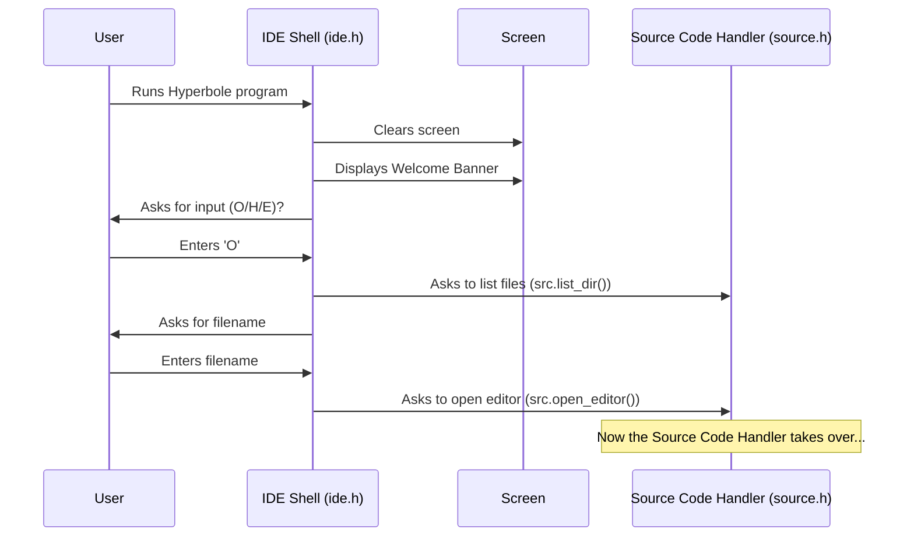

# Chapter 1: The IDE Shell - Your Welcome Desk

Welcome to the Hyperbole tutorial! We're excited to guide you through how this simple compiler works, piece by piece. Think of learning Hyperbole like exploring a small factory – each chapter will show you a different room or machine and explain its job.

Our first stop is the main entrance, the **IDE Shell**.

## What's the Point? The Grand Central Station

Imagine walking into a large building for the first time. You'd probably look for a reception desk or a main directory to figure out where to go next, right? The IDE Shell is exactly that for Hyperbole.

When you start the Hyperbole program, the IDE Shell is the first thing you see. It handles these main jobs:

1.  **Welcomes You:** It displays a friendly welcome screen.
2.  **Shows Your Options:** It tells you what you can do next (like open a file to write code, look up help, or leave).
3.  **Directs Traffic:** Based on your choice, it sends you to the correct part of the Hyperbole "factory" – the code editor, the help guide, or the exit.

**Use Case:** Let's say you just downloaded Hyperbole and want to run it to see what it does. The IDE Shell is what manages this initial interaction.

## Running Hyperbole: The First Encounter

When you run the Hyperbole program (which, under the hood, starts executing the `main` function in the `ide.h` file), the IDE Shell takes over your terminal.

First, it clears the screen and prints a welcome message.

```c++
// --- From ide.h ---

// Clears the screen (like wiping a chalkboard clean)
system("clear");

// Sets text color to bold red for the banner
cout << "\033[1;31m";

// Prints the fancy welcome banner line by line
printf("\t  *************************************************\n");
printf("\t  *                                               *\n");
// ... (rest of the banner lines) ...
printf("\t  *            WELCOME TO HYPERBOLE               *\n");
// ... (more banner lines) ...
printf("\t  *************************************************\n\n\n");

// Resets text color to default
cout << "\033[0m";
```

This code uses standard C++ functions like `system("clear")` to clear the terminal, `cout` and `printf` to display text, and some special codes (`\033[...]m`) to add color. The main goal is to present a nice visual welcome.

After the welcome message, it presents you with your main choices:

```c++
// --- From ide.h ---

// Asks the user what they want to do
cout<<"      Enter 'O' to open a file , 'H' to get help or 'E' to exit ";

// Prepares to read the user's single character input
char ch;
cin>>ch; // Waits for you to type O, H, or E and press Enter
```

This part is simple: it prints a question and waits for you to type a single letter (`'O'`, `'H'`, or `'E'`) followed by Enter. Your choice is stored in the `ch` variable.

## Making a Choice: Where Do You Want to Go?

The IDE Shell uses your input (`ch`) to decide what to do next. It uses a `switch` statement, which is like a multi-way crossroads.

```c++
// --- From ide.h ---

// Prepare instances of other parts of Hyperbole
help hlp;    // The help system object
source src; // The source code handling object

// This 'switch' checks the value of 'ch' (your input)
switch(ch){
    case 'h': // If you typed 'h'
    case 'H': // or 'H'
        // Code to show the help screen runs here...
        // We'll look at this more in the Help System chapter.
        cout << "You chose Help!\n"; // Simplified example
        // ... (actual help loop code is here) ...
        break; // Exit the switch

    case 'o': // If you typed 'o'
    case 'O': // or 'O'
        // Code to open the file editor runs here...
        // We'll explore this in the Source Code Handler chapter.
        cout << "You chose Open File!\n"; // Simplified example
        // ... (actual file opening/editing code is here) ...
        break; // Exit the switch

    // If you typed 'E' or 'e', the switch statement simply finishes,
    // and since there's nothing after it in main(), the program exits.
} // End of the switch statement
```

*   **If you press `H` (or `h`):** The IDE Shell activates the [Help System](03_help_system.md). Think of it sending you to the information desk. We'll dive into the `help hlp;` object and how it works in Chapter 3.
*   **If you press `O` (or `o`):** The IDE Shell activates the [Source Code Handler](02_source_code_handler.md). This is like being directed to a workshop where you can write or view blueprints (your code). We'll explore the `source src;` object in Chapter 2. It will first ask you for a filename and then open an editor view.
*   **If you press `E` (or `e`):** The program simply ends. It's like walking out the exit door. (In the actual code, if 'E' isn't matched by a `case`, the `switch` ends, and the `main` function finishes, thus exiting the program).

You might notice the `goto BEGIN;` and `goto FILE;` statements in the original code. These are used to jump back to the start of the welcome screen (`BEGIN`) or the file viewing loop (`FILE`) after an action is completed (like exiting help or finishing compilation). While `goto` works, it can sometimes make code harder to follow, so we often prefer loops or functions in modern programming.

## Under the Hood: How the Shell Coordinates

Let's visualize the flow when you start Hyperbole and choose to open a file:



The IDE Shell (`main` in `ide.h`) acts as the initial coordinator. It doesn't handle the *details* of editing files or showing help itself. Instead, it creates objects (`src`, `hlp`) representing those other modules and calls their functions when needed based on your input.

Inside the file opening (`case 'O'`) part, there's another loop for viewing and interacting with the file. This loop also contains options, including `'C'` for compiling:

```c++
// --- Simplified view inside 'case O' in ide.h ---

// ... after opening the file ...
FILE: // Label for goto jump
while(1){ // Loop forever until user quits
    // ... show the file content ...
    src.show_file();

    // Ask user what to do next (e.g., 'q' to quit, 'c' to compile)
    cout << "Enter 'q' to go back, 'c' to compile: ";
    flow = cin.get(); // Read next action

    if(flow=="q" || flow=="Q"){
        goto BEGIN; // Jump back to the main welcome screen
    }
    if(flow=="c" || flow=="C"){
        // If user enters 'c', jump to the COMPILE section
        goto COMPILE;
    }
    // ... potentially other options ...
} // End of file interaction loop

COMPILE: // Label for goto jump
    system("clear");
    cout<<"Terminal\n````````\n";
    // Create an Execution Engine object with the code
    execute exe(src.lol); // 'src.lol' holds the code lines
    // Tell the engine to run the code
    exe.executing();
    // ... show memory, wait for user ...
    goto FILE; // Jump back to viewing the file
```

Notice how choosing `'C'` leads to creating an `execute` object and calling `exe.executing()`. This interaction involves the [Source Code Handler](02_source_code_handler.md) (to provide the code via `src.lol`) and the [Execution Engine](04_execution_engine.md) (which actually runs the code). The IDE Shell code here orchestrates this transition.

## Conclusion

The **IDE Shell** is Hyperbole's front door and main navigator. It welcomes you, shows you the basic options (Edit, Help, Exit), and directs you to the appropriate module based on your choice. It uses simple input (`cin`) and conditional logic (`switch`) to manage the main flow of the application, coordinating between different parts like the file editor and the help system.

You've now seen the entry point! Next, we'll walk through one of the doors the IDE Shell can lead you to: the place where you actually write and manage your code.

Ready to see how Hyperbole handles your source code files? Let's move on to [Chapter 2: Source Code Handler](02_source_code_handler.md).

---

Generated by [AI Codebase Knowledge Builder](https://github.com/The-Pocket/Tutorial-Codebase-Knowledge)