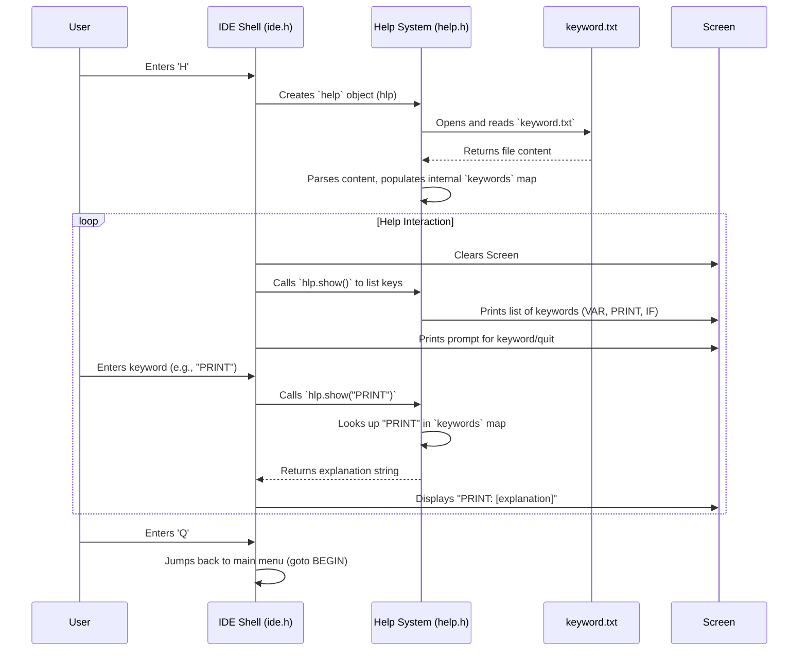

# Chapter 3: The Help System - Your Built-In Guide

In the previous chapters, we saw how the [IDE Shell](01_ide_shell.md) acts as the front desk, welcoming you and offering choices. We also explored how the [Source Code Handler](02_source_code_handler.md) acts like a librarian, managing your code files when you choose 'O'. But what happens if you choose 'H' for Help? Or what if you're editing a file and forget what a specific Hyperbole command does?

That's where our next component comes in: the **Help System**.

## What's the Point? An Instant Glossary

Imagine you're learning a new board game. Wouldn't it be handy to have a quick rule reference right there, without having to dig out the full instruction manual every time you forget what a specific card does?

The Help System in Hyperbole is exactly that: a quick, built-in reference guide. It provides:

1.  **Instant Access:** Get help directly within the Hyperbole program.
2.  **Focused Information:** Look up specific keywords or commands used in the Hyperbole language (like `VAR`, `PRINT`, `IF`).
3.  **Easy Updates:** The help information is stored in a simple text file (`keyword.txt`), making it easy to add or modify later.

**Use Case:** You're trying to write some Hyperbole code, but you can't remember exactly how to declare a variable. You go back to the main Hyperbole menu (or maybe there's a help option elsewhere), press 'H', see a list of available topics, type `VAR`, and instantly get a short explanation of how the `VAR` keyword is used.

## Key Concepts: How Help Works

The Help System relies on a few simple ideas:

1.  **The Keyword File (`keyword.txt`):** This is a plain text file that acts like the Help System's brain. It stores pairs of keywords and their explanations in a specific format. Think of it as a simple dictionary file.

    *Format Example (`keyword.txt`):*
    ```
    VAR:Used to declare a variable. Usage - VAR variable_name : initial_value;
    PRINT:Displays text or variable values to the screen. Usage - PRINT "message" OR variable_name;
    IF:Used for conditional checks. Usage - IF condition { code_block };
    ```
    Each entry has a `KEYWORD`, followed by a colon `:`, followed by the `explanation`, and ends with a semicolon `;`.

2.  **The Help Librarian (`help` class):** In the code (`help.h`), there's a blueprint called `help`. When the Help System is needed, Hyperbole creates an object from this blueprint. Think of this object as a helpful librarian.
    *   When the librarian starts work (when the `help` object is created), it reads the `keyword.txt` file.
    *   It organizes all the keywords and their explanations into an easy-to-search internal list (specifically, a C++ `map` called `keywords`).

3.  **The Lookup Process:**
    *   When you ask for help, the system first shows you all the keywords the librarian knows about (listing the keys from the internal map).
    *   When you type a specific keyword, the librarian quickly looks up that keyword in its internal list and gives you the corresponding explanation.

## Using the Help System: Asking the Librarian

Let's see how you interact with the Help System via the [IDE Shell](01_ide_shell.md).

1.  **Start Hyperbole:** You run the program, and the IDE Shell welcomes you.
    ```
          Enter 'O' to open a file , 'H' to get help or 'E' to exit
    ```

2.  **Choose Help:** You type `H` and press Enter.

3.  **See Available Topics:** The IDE Shell activates the Help System. The screen clears, and the Help System lists all the keywords it found in `keyword.txt`.

    ```c++
    // --- Inside case 'H' in ide.h ---
    help hlp; // Create the Help Librarian object (reads keyword.txt now!)
    // ... loop starts ...
    system("clear");
    cout<<"HELP\n\n";
    hlp.show(); // Ask the librarian to list all known keywords
    ```
    The `hlp.show()` call displays something like this (based on our example `keyword.txt`):
    ```
    HELP

    - VAR
    - PRINT
    - IF

    Enter a keyword from the above list to get help OR 'Q' to exit help:
    ```

4.  **Ask About a Keyword:** Let's say you want to know about `PRINT`. You type `PRINT` and press Enter.

    ```c++
    // --- Inside case 'H' in ide.h ---
    // ... previous output shown ...
    cout << "\n\nEnter a keyword from the above list to get help OR 'Q' to exit help: ";
    string flow; // Variable to store user input
    cin >> flow; // Read the keyword the user types (e.g., "PRINT")
    // ... code checks if user entered 'Q' to quit ...

    // If not quitting, the loop continues, and on the next iteration:
    system("clear"); // Clear screen again
    cout<<"HELP\n\n";
    hlp.show(); // Show the list of keywords again
    if(flow != "start"){ // Check if user entered a keyword (not the initial state)
       // Ask the librarian for the explanation of the entered keyword
       cout << "\n" << flow << ": " << hlp.show(flow) << endl;
    }
    ```
    The `hlp.show(flow)` part is where the magic happens. It asks the `help` object (`hlp`) to look up the definition for the keyword stored in the `flow` variable (which is "PRINT" in our case).

5.  **Get the Answer:** The Help System finds the explanation for "PRINT" and displays it below the keyword list.

    ```
    HELP

    - VAR
    - PRINT
    - IF

    PRINT: Displays text or variable values to the screen. Usage - PRINT "message" OR variable_name;

    Enter a keyword from the above list to get help OR 'Q' to exit help:
    ```

6.  **Continue or Quit:** You can now enter another keyword to learn about it, or type `Q` (or `q`) to exit the Help System and go back to the main IDE Shell menu.

    ```c++
    // --- Inside case 'H' in ide.h ---
    // ... after getting keyword input into 'flow' ...
    if(flow == "q" || flow == "Q"){
        goto BEGIN; // Jump back to the main welcome screen
    }
    // Otherwise, the loop repeats, showing the list and the new definition
    ```

## Under the Hood: Reading the Dictionary

How does the Help System actually read `keyword.txt` and perform the lookups?

**Step-by-Step Flow:**

1.  **User selects 'H'**: The IDE Shell (`ide.h`) detects the 'H' input.
2.  **Create `help` Object**: The IDE Shell creates an instance of the `help` class: `help hlp;`.
3.  **Constructor Runs (`help::help()`):** The moment `hlp` is created, its *constructor* automatically runs. This special function's job is to initialize the object.
    *   It opens the `keyword.txt` file.
    *   It reads the entire content of the file.
    *   It loops through the content, character by character, parsing out the `keyword:explanation;` pairs.
    *   It stores these pairs in an internal `map` called `keywords`. A map is like a dictionary – you can quickly find a definition (value) if you know the word (key).
4.  **Enter Help Loop**: The IDE Shell enters a loop specifically for the help screen.
5.  **List Keywords (`hlp.show()`):** Inside the loop, `hlp.show()` is called. This function iterates through the `keywords` map and prints out each keyword (the keys of the map).
6.  **Get User Input**: The program prompts the user to enter a keyword or 'Q'.
7.  **Lookup Keyword (`hlp.show(key)`):** If the user enters a keyword (e.g., "PRINT"), the `hlp.show("PRINT")` function is called.
    *   This function looks up "PRINT" as a key in the `keywords` map.
    *   If found, it returns the associated explanation (value).
    *   If not found, it returns a "doesn't exist" message.
8.  **Display Result**: The IDE Shell prints the keyword and the result returned by `hlp.show(key)`.
9.  **Loop or Exit**: The loop continues until the user enters 'Q', at which point a `goto BEGIN;` statement jumps execution back to the start of the main menu in `ide.h`.

**Visualizing the Interaction:**



**Code Dive: The Librarian's Methods**

Let's peek inside `help.h` to see how the librarian works.

1.  **The Constructor (`help::help()`): Reading the File**
    This function runs automatically when a `help` object is created. Its main job is to read `keyword.txt` and fill the `keywords` map.

    ```c++
    // --- Simplified from help::help() in help.h ---
    help::help(){
        fstream file;
        file.open("keyword.txt"); // Try to open the file
        if(file.fail()){
            cout << "Cannot read keywords configuration file";
            return; // Exit if file can't be opened
        }

        // Read the whole file into a single string 's' (simplified)
        string s = "", line;
        while(getline(file, line)) { s += line; }
        file.close();

        string k = "", v = ""; // Temporary strings for key and value
        bool reading_key = true; // Are we currently reading the key or value?

        for(unsigned int i = 0; i < s.length(); i++){
            if(reading_key){
                if(s[i] == ':'){ // Found separator between key and value
                    reading_key = false; // Start reading the value next
                } else {
                    k += s[i]; // Add character to the key
                }
            } else { // We are reading the value
                if(s[i] == ';'){ // Found end of entry
                    keywords.insert({k, v}); // Add key-value pair to the map!
                    k = ""; v = ""; // Reset for next entry
                    reading_key = true; // Start looking for a key again
                } else {
                    v += s[i]; // Add character to the value
                }
            }
        }
    }
    ```
    This code reads the file, then loops through the text. It builds up the `k` (key) string until it hits a `:`, then builds the `v` (value) string until it hits a `;`. Once it hits `;`, it stores the pair in the `keywords` map and resets `k` and `v` to find the next entry.

2.  **Listing Keywords (`help::show()`):**
    This function simply goes through the `keywords` map and prints each key.

    ```c++
    // --- From help::show() in help.h ---
    void help::show(){
        // 'map<string, string>::iterator' is a tool to visit each item in the map
        map<string, string>::iterator it;

        // Loop from the beginning (keywords.begin()) to the end (keywords.end())
        for(it = keywords.begin(); it != keywords.end(); it++){
            // 'it->first' refers to the keyword (the key) of the current item
            cout << "- " << it->first << "\n"; // Print the keyword
        }
    }
    ```

3.  **Getting a Definition (`help::show(string key)`):**
    This function takes a keyword (`key`) as input and tries to find its definition in the map.

    ```c++
    // --- From help::show(string key) in help.h ---
    string help::show(string key){
        // Try to find the key in the map
        map<string, string>::iterator it = keywords.find(key);

        // Check if the key was found (it != keywords.end())
        if(it != keywords.end()){
            // Key found! Return the corresponding value (the definition)
            // 'it->second' refers to the value associated with the key
            return it->second;
        } else {
            // Key wasn't found in the map
            return "doesn't exist";
        }
    }
    ```
    *(Note: The original code used a loop and `keywords.at(key)`, which works but `map::find` is often more idiomatic for checking existence before access. The logic is functionally similar for beginners.)*

## Conclusion

The **Help System** provides a simple yet effective way for users to get quick information about Hyperbole keywords without leaving the program. It acts like an interactive glossary, reading definitions from the external `keyword.txt` file using the `help` class.

The `help` object reads and parses `keyword.txt` when created, stores the information in a handy `map`, and provides functions to list all available keywords (`show()`) or retrieve the definition for a specific keyword (`show(string key)`). The [IDE Shell](01_ide_shell.md) coordinates the user interaction, calling these functions based on user input when the 'H' option is selected.

So far, we've seen how Hyperbole greets you (IDE Shell), how it handles your code files (Source Code Handler), and how it provides help (Help System). Now, the exciting part: how does Hyperbole actually *run* the code that the Source Code Handler prepared?

Let's move on to the engine room!

Next Up: [Chapter 4: Execution Engine](04_execution_engine.md)

---

Generated by [AI Codebase Knowledge Builder](https://github.com/The-Pocket/Tutorial-Codebase-Knowledge)