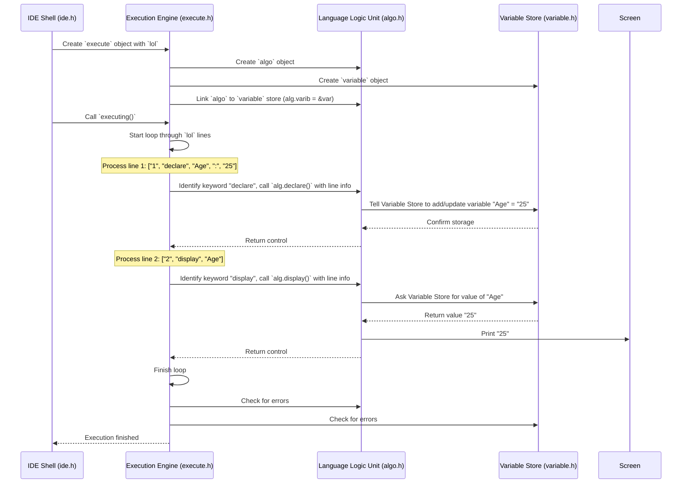

# Chapter 4: The Execution Engine - Running Your Code

Welcome back! In [Chapter 2: Source Code Handler](02_source_code_handler.md), we saw how Hyperbole reads your `.hyp` file and organizes it into a structured format called `lol` (a list of lists of strings), like a librarian preparing a detailed summary of a book. In [Chapter 3: The Help System](03_help_system.md), we learned how to get quick help on keywords.

But just having an organized summary isn't enough – we want the program to actually *do* what the code says! This is where the **Execution Engine** comes in.

## What's the Point? The Conductor of the Orchestra

Imagine you have a musical score (your parsed code, the `lol`). The score tells different instruments when and what to play. But the score itself doesn't make music. You need a **conductor** to read the score, signal the violins to play their part, tell the trumpets when to chime in, and keep everyone in sync.

The Execution Engine in Hyperbole is that conductor. It takes the parsed `lol` structure and reads it line by line. Its main jobs are:

1.  **Reading the Score:** It goes through your code, one instruction at a time.
2.  **Identifying Instruments:** It recognizes the keywords (like `display`, `declare`, `loop`, `check`) which tell it *what kind* of action needs to happen.
3.  **Directing the Players:** It tells other specialized parts of Hyperbole what to do:
    *   It asks the [Language Logic Unit (ALGO)](05_language_logic_unit__algo_.md) (think: the lead musician for specific techniques) to perform actions like printing text or doing calculations.
    *   It interacts with the [Variable Store](06_variable_store.md) (think: the sheet music stand holding temporary notes) to keep track of variable values.
4.  **Managing the Flow:** It handles the order of execution, especially for loops (`loop`/`loopit`) and conditional logic (`check`/`otherwise`), ensuring the right parts of the score are played or skipped.

**Use Case:** You've written a simple Hyperbole program like this:
```hyperbole
declare Age : 25;
display "My age is: ";
display Age;
```
The [Source Code Handler](02_source_code_handler.md) turns this into `lol`. Now, you press 'C' to compile (which actually means interpret/run in Hyperbole's case). The Execution Engine takes this `lol` and makes the program print "My age is: 25" to the screen.

## How It Works: Following the Script

When you choose to compile ('C') your code from the file view in the [IDE Shell](01_ide_shell.md), the shell does two main things:

1.  **Creates the Engine:** It creates an `execute` object, passing the `lol` (parsed code) from the `source` object to it.

    ```c++
    // --- Simplified from ide.h (inside COMPILE block) ---
    // 'src.lol' holds the parsed code (list of lists of strings)
    execute exe(src.lol); // Create the Execution Engine conductor
    ```
    This is like handing the musical score to the conductor.

2.  **Starts Execution:** It calls the `executing()` method on the `execute` object.

    ```c++
    // --- Simplified from ide.h (inside COMPILE block) ---
    exe.executing(); // Tell the conductor to start the performance!
    ```
    This is the signal for the conductor to start reading the score and leading the orchestra.

The `executing()` method is the heart of the engine. It loops through each line (each inner list) in the `lol` structure. For each line, it looks at the main command (usually the first word after the line number) and decides what to do.

Let's trace our simple example: `lol` might look like this:
```
[
  ["1", "declare", "Age", ":", "25"],
  ["2", "display", "\"My age is: \""],
  ["3", "display", "Age"]
]
```

1.  **Line 1:** The engine sees the keyword `declare`. It knows this means creating a variable. It calls a helper function (from the [ALGO](05_language_logic_unit__algo_.md) unit) to handle the details of storing the variable `Age` with the value `25` in the [Variable Store](06_variable_store.md).
2.  **Line 2:** The engine sees `display`. It knows this means showing something on the screen. It calls another helper function (again, likely in [ALGO](05_language_logic_unit__algo_.md)) to print the text "My age is: ".
3.  **Line 3:** The engine sees `display` again. This time, the argument is `Age`. The engine (via its helpers) looks up the value of `Age` in the [Variable Store](06_variable_store.md) (finds `25`) and then calls the helper function to print `25` to the screen.

## Under the Hood: The Conductor's Actions

Let's peek inside the `execute` class (defined in `execute.h`) to see how the conductor manages the performance.

**Step-by-Step Flow (Conceptual):**

1.  **Initialization:** When an `execute` object is created, it stores the `lol` code and sets up connections to its helpers: an `algo` object (for actions) and a `variable` object (for storing variables). It specifically links the `algo` object to the `variable` object so `algo` can access variables.
2.  **Start `executing()`:** The main loop begins, iterating through the lines in the `lol`.
3.  **Get Keyword:** For each line, the engine extracts the keyword (e.g., `declare`, `display`).
4.  **Dispatch Action:** Based on the keyword, it calls the corresponding function in the `algo` object (e.g., `alg.declare()`, `alg.display()`).
5.  **Handle Flow Control:** If it encounters `check` or `loop`, it uses special logic (often involving the `algo` object checking a condition) to decide whether to execute the next lines or skip ahead (using `advance(itr, ...)` to move the line iterator). For loops (`loop`/`loopit`), it might jump back to a previous line.
6.  **Repeat:** Continue until all lines are processed.
7.  **Report Errors:** After trying to run all lines, it asks its helpers (`algo` and `variable`) if any errors occurred during execution and displays them.

**Visualizing the Interaction (Simple Example: `declare Age : 25; display Age;`)**



**Code Dive: Inside `execute.h`**

Let's look at simplified snippets from the code.

1.  **The Constructor (`execute::execute`): Getting Ready**
    This runs when `execute exe(src.lol);` is called. It stores the code and prepares the helpers.

    ```c++
    // --- Simplified from execute::execute() in execute.h ---
    execute::execute(list<list<string> > lol){
        code = lol; // Store the parsed code ('lol') given to us
        // The 'variable var;' and 'algo alg;' members are automatically created.
        // We need to tell the 'algo' object where the 'variable' store is:
        alg.varib = &var; // Give 'algo' a pointer to our 'variable' object

        // Initialize counters for nested loops/checks (used for flow control)
        loop_balance = 0;
        check_balance = 0;
    }
    ```
    The crucial part here is `alg.varib = &var;`. This lets the `algo` object directly interact with the `variable` object to get or set variable values when needed.

2.  **The Main Loop (`execute::executing`): Reading Line by Line**
    This is the core method that steps through the code.

    ```c++
    // --- Simplified from execute::executing() in execute.h ---
    void execute::executing(){
        // 'itr' is an iterator, like a bookmark, pointing to the current line in 'code'
        list<list<string> >::iterator itr;

        // Loop from the first line (code.begin()) to the end (code.end())
        for(itr = code.begin(); itr != code.end(); itr++){
            list<string> current_line = *itr; // Get the list of words for the current line
            list<string>::iterator word_itr = current_line.begin(); // Bookmark for words

            advance(word_itr, 1); // Move past the line number to the first keyword/word

            // Give the whole line info to the algo helper, it might need other words too
            alg.l = current_line;

            // --- Keyword Dispatch ---
            // Check the keyword (the word the bookmark 'word_itr' is pointing to)
            if(*word_itr == "display"){
                alg.display(); // Ask algo to handle display
            }
            else if(*word_itr == "declare"){
                alg.declare(); // Ask algo to handle declaration
            }
            else if(*word_itr == "fetch"){
                alg.fetch();   // Ask algo to handle fetching input
            }
            // ... other keywords like "check", "loop" etc. ...
            else if(*word_itr == "check"){
                // Handle conditional logic (details omitted for simplicity)
                // Might involve alg.condition() and skipping lines using advance(itr, ...)
            }
            else if(*word_itr == "loop"){
                // Handle loop logic (details omitted for simplicity)
                // Might involve alg.condition() and jumping/skipping lines
            }
            else {
                // If it's not a known keyword, maybe it's a variable assignment?
                alg.expression(); // Ask algo to try and process it as an expression
            }
        } // End of loop through lines

        // After the loop, display any errors collected by algo or var
        alg.show_errors();
        var.show_errors();
    }
    ```
    This loop structure is key: iterate, get the line, find the keyword, and delegate to the `algo` helper (`alg`).

3.  **Handling Flow Control (Conceptual)**
    Keywords like `check` and `loop` require changing the normal line-by-line flow. The actual code uses `advance(itr, N)` to skip `N` lines forward or `advance(itr, -N)` to jump back (though jumping back is usually managed differently for loops).

    *   **`check` (If):** If the condition `alg.condition()` is false, the engine needs to skip lines until it finds the matching `checkit` or `otherwise`. It does this by advancing `itr` inside a `while` loop until the block is passed.
    *   **`loop` (While/For):** If the condition `alg.condition()` is true, it executes the loop body. When it hits `loopit`, it needs to jump back to the corresponding `loop` line. The code uses a `stack<string> flow` to remember the line number of the start of the loop, and then uses `advance(itr, line_offset)` to reposition the iterator back to the start of the loop. If the condition is false, it skips the entire loop block similar to how `check` skips its block.

    These parts are more complex, relying on careful management of the `itr` iterator and balance counters (`check_balance`, `loop_balance`) to handle nested structures correctly. We'll see more about `alg.condition()` in the next chapter.

## Conclusion

The **Execution Engine** is the heart of Hyperbole's interpreter. It acts like an orchestra conductor, reading the parsed code (`lol`) line by line. It identifies keywords and directs the flow of execution, calling upon the [Language Logic Unit (ALGO)](05_language_logic_unit__algo_.md) to perform specific actions (like displaying output or calculations) and the [Variable Store](06_variable_store.md) to manage variable data. It also handles control structures like conditionals (`check`) and loops (`loop`) to execute the correct parts of your code.

You've now seen how the code gets read, parsed, and finally executed! But how does the engine *actually* display text, declare variables, or check conditions? That's the job of the specialist helper we keep mentioning.

Let's dive into the details of the component that handles the specific Hyperbole language commands.

Next Up: [Chapter 5: Language Logic Unit (ALGO)](05_language_logic_unit__algo_.md)

---

Generated by [AI Codebase Knowledge Builder](https://github.com/The-Pocket/Tutorial-Codebase-Knowledge)