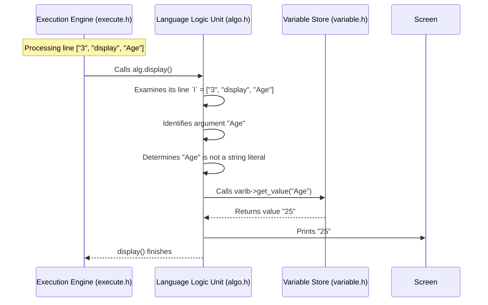

# Chapter 5: Language Logic Unit (ALGO) - The Language's Toolbox

In [Chapter 4: Execution Engine](04_execution_engine.md), we learned how the Execution Engine acts like a conductor, reading the parsed code (`lol`) line by line and deciding *what* needs to happen next (like declaring a variable, displaying something, or starting a loop). However, the Execution Engine doesn't know the specific *details* of how to perform each Hyperbole language command. It delegates those tasks to a specialist.

Meet the **Language Logic Unit**, often referred to as **ALGO** (because its code is primarily in `algo.h`).

## What's the Point? The Specialist Tools

Imagine our Execution Engine conductor is building something based on blueprints (your code). The conductor knows *when* a screw needs to be tightened or *when* a measurement needs to be taken. But they don't physically do it themselves. They reach into a **toolbox (ALGO)** and grab the right tool – a screwdriver, a tape measure, maybe even a calculator – to get the job done.

The ALGO unit is Hyperbole's toolbox. It contains the specific functions (tools) that actually implement the core features of the Hyperbole language. It handles tasks like:

1.  **Displaying Output:** Printing text or variable values to the screen (`display`).
2.  **Getting Input:** Reading input from the user (`fetch`).
3.  **Declaring Variables:** Telling the [Variable Store](06_variable_store.md) to remember a new variable (`declare`).
4.  **Math & Logic:** Evaluating mathematical expressions (`5 + 3`) and conditional expressions (`Age > 18`).
5.  **Data Conversion:** Changing strings (like `"123"`) into numbers (like `123`) and back.
6.  **Reporting Errors:** Keeping track of problems found while executing these tasks (e.g., using an undefined variable).

**Use Case:** Let's revisit our simple code:
```hyperbole
declare Age : 25;
display "My age is: ";
display Age;
```
The [Execution Engine](04_execution_engine.md) reads line 1 and sees `declare`. It tells ALGO: "Hey, declare a variable named `Age`". ALGO does the work (interacting with the [Variable Store](06_variable_store.md)).
Then, the Engine reads line 2 (`display "My age is: "`). It tells ALGO: "Display this text." ALGO performs the printing.
Finally, the Engine reads line 3 (`display Age`). It tells ALGO: "Display the value of `Age`." ALGO gets the value `25` from the [Variable Store](06_variable_store.md) and prints it.

ALGO contains the specific instructions for *how* to declare, *how* to display, and *how* to interact with variables.

## Key Responsibilities: The Tools in the Box

Let's look at the main tools (functions) inside the ALGO unit (`algo.h`):

*   **`display()`:** Takes information from the current code line and prints it to the screen. It checks if the item to display is a literal string (like `"Hello"`) or a variable name. If it's a variable name, it asks the [Variable Store](06_variable_store.md) for its current value before printing.
*   **`fetch()`:** Pauses the program and waits for the user to type something. It takes the user's input and stores it in a specified variable (using the [Variable Store](06_variable_store.md)).
*   **`declare()`:** Takes a variable name from the code line and tells the [Variable Store](06_variable_store.md) to create an entry for it, often with a default "declared" status or an initial value if provided later via assignment. (Note: In Hyperbole, `declare X : 10` actually happens in two steps: `declare X` registers the name, and then an implicit assignment `X = 10` happens via the `expression()` logic).
*   **`expression()` & `evaluate()`:** These are the calculator tools. When the code has something like `X = 5 * (Y + 2)`, `expression()` figures out which part is the variable being assigned (`X`) and which part is the calculation (`5 * (Y + 2)`). It then calls `evaluate()` to compute the result of the calculation. `evaluate()` handles order of operations (PEMDAS/BODMAS), fetches variable values (like `Y`) from the [Variable Store](06_variable_store.md), and returns the final numerical result.
*   **`condition()`:** Similar to `evaluate()`, but specifically for logical conditions found in `check` (if) or `loop` statements (like `Age < 18` or `Count == 10`). It evaluates the condition and returns `true` (represented as 1) or `false` (represented as 0).
*   **`string_to_int()` & `int_to_string()`:** Utility tools for converting between text representations of numbers (like `"42"`) and actual integer numbers (`42`) that can be used in calculations.
*   **Error Handling (`errors` string, `show_errors()`):** If any tool encounters a problem (e.g., trying to use a variable that wasn't declared, dividing by zero), it adds an error message to a special `errors` string within the ALGO object. The `show_errors()` function is called by the [Execution Engine](04_execution_engine.md) at the end to print out any collected error messages.

## How the Execution Engine Uses ALGO

As we saw in Chapter 4, the [Execution Engine](04_execution_engine.md) has an `algo` object (usually named `alg`). When the engine processes a line of code, it calls the appropriate function on `alg`.

```c++
// --- Simplified snippet from execute::executing() in execute.h ---

// 'itr' points to the current line in the parsed code 'lol'
list<string> current_line = *itr; // Get the current line (e.g., ["3", "display", "Age"])
list<string>::iterator word_itr = current_line.begin(); // Point to line number
advance(word_itr, 1); // Move to the command (e.g., "display")

alg.l = current_line; // Give ALGO the whole line context

// Check the command and call the corresponding ALGO function
if(*word_itr == "display"){
    alg.display(); // Tell ALGO to handle the display command
}
else if(*word_itr == "declare"){
    alg.declare(); // Tell ALGO to handle the declare command
}
else if(*word_itr == "fetch"){
    alg.fetch();   // Tell ALGO to handle the fetch command
}
// ... and so on for other commands like 'check', 'loop', or assignments ...
else {
    // If it's not a specific command, assume it's an assignment or expression
    alg.expression(); // Ask ALGO to evaluate it
}
```
The Execution Engine identifies the main keyword and delegates the specific action to the `alg` object. It also gives `alg` the current line (`alg.l = current_line;`) so the ALGO function knows which variable names or values to work with.

## Under the Hood: A Look Inside the Toolbox

Let's see how ALGO performs a task like displaying output.

**Step-by-Step: `alg.display()` for `display Age`**

1.  **Engine Calls `alg.display()`:** The Execution Engine encounters the `display Age` line and calls the `display()` function on its `algo` object (`alg`). The `alg` object already knows the current line is `["3", "display", "Age"]` because the engine set `alg.l`.
2.  **ALGO Gets Arguments:** The `display()` function looks at the rest of the line (after the "display" keyword) – in this case, just "Age".
3.  **Check Type:** It checks if "Age" is a literal string (does it start and end with `"`?). No.
4.  **Assume Variable:** It assumes "Age" is a variable name.
5.  **Access Variable Store:** ALGO needs the value of `Age`. Crucially, the ALGO object has a pointer (`varib`) to the main [Variable Store](06_variable_store.md) object (this link was set up when the Execution Engine was created). ALGO uses this pointer to ask the Variable Store: "What is the value of `Age`?"
6.  **Get Value:** The Variable Store looks up "Age" and returns its value (e.g., "25").
7.  **Check for Errors:** If the Variable Store couldn't find "Age", it would return a special signal (`"\0"`). ALGO would notice this and add an "undefined variable" error message to its `errors` string.
8.  **Print Value:** Assuming the value "25" was found, ALGO uses C++'s `cout` to print "25" to the screen.
9.  **Return to Engine:** The `display()` function finishes, and control returns to the Execution Engine, which moves to the next line.

**Visualizing the Interaction:**



**Code Dive: Inside `algo.h`**

Let's look at simplified versions of some ALGO functions.

1.  **Connecting to the Variable Store:**
    The `algo` class has a member variable `variable *varib;`. This is a *pointer* – an address telling ALGO where the actual [Variable Store](06_variable_store.md) object lives in memory. This connection is established by the Execution Engine.

    ```c++
    // --- Inside algo.h ---
    class algo {
    public:
        list<string> l;      // Stores the current line being processed
        string errors = "";   // Collects error messages
        variable *varib;   // Pointer to the Variable Store object!

        // ... function declarations like display(), declare(), evaluate() ...
        void show_errors();
    };

    // --- Inside execute::execute() constructor in execute.h ---
    execute::execute(list<list<string> > lol) {
        code = lol;
        // 'var' is the Variable Store object inside 'execute'
        // 'alg' is the ALGO object inside 'execute'
        alg.varib = &var; // Make alg's pointer point to var's address!
        // ...
    }
    ```
    This `alg.varib = &var;` line is crucial. It allows any function inside `alg` to access the shared variable data via the `varib` pointer (e.g., `varib->get_value(...)`).

2.  **`display()` Function:**

    ```c++
    // --- Simplified from algo::display() in algo.h ---
    void algo::display() {
        // 'l' is the current line, e.g., ["3", "display", "Age"] or ["2", "display", "\"Hello\""]
        list<string>::iterator it = next(l.begin()); // Skip line number
        it++; // Skip the "display" keyword itself

        // Loop through the remaining items on the line
        for (; it != l.end(); it++) {
            string item_to_display = *it; // Get the current item (e.g., "Age" or "\"Hello\"")

            // Check if it's a variable
            string value = varib->get_value(item_to_display);
            if (value != "\0") { // "\0" means variable not found
                cout << value; // Print the variable's value
            }
            // Check if it's a string literal (starts and ends with ")
            else if (item_to_display[0] == '"' && item_to_display.back() == '"') {
                // Remove the quotes and print the inner text
                cout << item_to_display.substr(1, item_to_display.size() - 2);
            }
            // Check for special keyword 'nextln' for newline
            else if (item_to_display == "nextln") {
                 cout << endl;
            }
            // Otherwise, it's an error (e.g., undefined variable)
            else {
                errors += "display error: undefined variable '" + item_to_display + "';";
            }
        }
    }
    ```
    This function iterates through the arguments after `display`, checks if each is a known variable (using `varib->get_value`) or a literal string, and prints accordingly. Errors are added to the `errors` string.

3.  **`declare()` Function:**
    This function is simpler. It tells the Variable Store to remember the name. (Assigning the initial value is handled separately by `expression()` logic).

    ```c++
    // --- Simplified from algo::declare() in algo.h ---
    void algo::declare() {
        // 'l' is the current line, e.g., ["1", "declare", "Age", ":", "25"]
        list<string>::iterator it = next(l.begin()); // Skip line number
        it++; // Skip the "declare" keyword

        // Loop through items after "declare" (usually just the variable name)
        for (; it != l.end(); it++) {
            // Stop if we hit the ':' separator or other syntax elements
            if (*it == ":") break;

            string variable_name = *it;
            // Tell the variable store to remember this name
            // Set a placeholder value like "declared" initially.
            varib->set_value(variable_name, "declared");
        }
        // Note: The actual assignment (like Age = 25) is often handled
        // by the expression() logic called by the Execution Engine later
        // for the rest of the line, or in a separate assignment statement.
    }
    ```

4.  **`evaluate()` (Conceptual):**
    Evaluating expressions like `5 * (Age + 2)` is complex. The `evaluate` function uses two stacks (like stacks of plates): one for numbers (`values`) and one for operators (`ops`). It reads the expression, pushing numbers onto the `values` stack. When it sees an operator, it considers its precedence (multiplication before addition). If the new operator has lower or equal precedence than the operator on top of the `ops` stack, it pops the operator and two values, performs the operation (`applyOp`), and pushes the result back onto the `values` stack. This process continues until the expression is fully calculated. It also handles fetching variable values (like `Age`) using `varib->get_value()` and converting them to integers (`string_to_int`) before pushing them onto the `values` stack.

5.  **Helper Utilities:**
    Functions like `string_to_int` and `int_to_string` use C++ `stringstream` to easily convert between data types.

    ```c++
    // --- Simplified from algo.h ---
    int algo::string_to_int(string str) {
        int num;
        stringstream converter(str); // Put the string into a stream
        converter >> num;          // Read the integer out of the stream
        // Add error handling if conversion fails
        return num;
    }

    string algo::int_to_string(int num) {
        string str;
        stringstream converter;     // Create an empty stream
        converter << num;          // Put the integer into the stream
        str = converter.str();     // Get the string representation
        return str;
    }
    ```

6.  **Error Reporting:**
    When errors occur, messages are appended to the `errors` string. At the end of execution, the engine calls `show_errors()`.

    ```c++
    // --- Simplified from algo::show_errors() in algo.h ---
    void algo::show_errors() {
        if (!errors.empty()) {
             cout << "\n--- ALGO Errors ---" << endl;
             // Loop through the error string and print each message nicely
             string current_error;
             for(char c : errors) {
                 if (c == ';') { // Semicolon marks the end of an error message
                     cout << "- " << current_error << endl;
                     current_error = ""; // Reset for next message
                 } else {
                     current_error += c;
                 }
             }
             cout << "--------------------\n";
        }
    }
    ```

## Conclusion

The **Language Logic Unit (ALGO)** is the essential toolbox for the Hyperbole language. It doesn't decide *when* things happen (that's the [Execution Engine](04_execution_engine.md)'s job), but it knows *how* to perform the specific actions defined by Hyperbole keywords like `display`, `fetch`, `declare`, and how to evaluate mathematical and logical expressions. It works closely with the [Variable Store](06_variable_store.md) to access and modify variable data, using a pointer (`varib`) provided by the Execution Engine. ALGO also plays a crucial role in collecting and reporting errors encountered during execution.

Now that we understand how ALGO uses variables, let's take a closer look at the component responsible for actually storing and managing them.

Next Up: [Chapter 6: Variable Store](06_variable_store.md)

---

Generated by [AI Codebase Knowledge Builder](https://github.com/The-Pocket/Tutorial-Codebase-Knowledge)