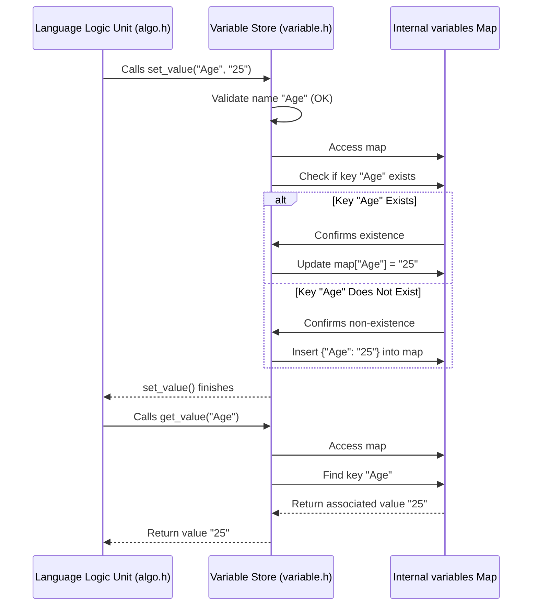

# Chapter 6: Variable Store - The Program's Memory

In the previous chapter, [Chapter 5: Language Logic Unit (ALGO)](05_language_logic_unit__algo_.md), we saw how the ALGO unit acts like a toolbox, performing specific actions like displaying text or calculating math problems. We noticed that ALGO often needed to remember pieces of information (like the value of `Age`) or store results. But how does it remember? Where does that information go?

That's the job of our final component: the **Variable Store**.

## What's the Point? The Program's Whiteboard

Imagine you're solving a math problem on a whiteboard. You might write down intermediate results or definitions. For example:

*   Let `x = 5`
*   Let `y = 10`
*   Calculate `x + y` ... (You look up `x` and `y` on the board) ... Result is 15.

Your program needs a similar place to keep track of named pieces of data that can change. This "whiteboard" is the Variable Store.

Its main purpose is to:

1.  **Remember Values:** Store the connection between a name (like `Age`) and its current value (like `"25"`).
2.  **Retrieve Values:** Look up a name and find the value associated with it.
3.  **Update Values:** Change the value associated with a name if the program asks.

**Use Case:** Let's say your Hyperbole code is:
```hyperbole
declare Name : "Bob"; // Store "Bob" under the name "Name"
display "Hello, ";
display Name; // Look up "Name" and display its value
```
The Variable Store is what allows the program to remember that `Name` holds the value `"Bob"` between the first line and the last line. Without it, the program would have no memory!

## Key Concepts: How the Whiteboard Works

1.  **Name-Value Pairs:** The Variable Store primarily works with pairs of information: a **variable name** (like `MyScore`) and its corresponding **value** (like `"100"`). Think of it like a dictionary where the word is the name and the definition is the value.
2.  **String Storage:** In Hyperbole's Variable Store (`variable.h`), all values are stored as text (strings). Even if you store the number `25`, it's kept as the string `"25"`. The [Language Logic Unit (ALGO)](05_language_logic_unit__algo_.md) handles converting this text to a number when needed for calculations.
3.  **The Map:** Under the hood, the Variable Store uses a data structure called a `map` (specifically `std::map` in C++). A map is very efficient at looking up a value if you know its key (the variable name).
    *   `variables: { "Name": "Bob", "Age": "25", "Score": "100" }`
4.  **Setting Values (`set_value`):** When the code says `declare X : 10` or `X = Y + 5`, the [Language Logic Unit (ALGO)](05_language_logic_unit__algo_.md) ultimately tells the Variable Store to *set* a value. This involves:
    *   Checking if the variable name is valid (e.g., starts with a letter, contains only letters, numbers, or underscore).
    *   If the name is valid, adding the name-value pair to the map. If the name already exists, its value is updated.
5.  **Getting Values (`get_value`):** When the code needs the value of a variable (like in `display X` or `Z = X + 1`), ALGO asks the Variable Store to *get* the value associated with the name `X`.
    *   The Variable Store looks for `X` in its map.
    *   If found, it returns the stored value (e.g., `"10"`).
    *   If not found (maybe the variable was never declared), it returns a special signal (`"\0"`) to indicate an error.
6.  **Error Tracking:** The Variable Store keeps its own list of errors, mostly related to invalid variable names. If you try to use a name like `123Invalid`, the `set_value` function will record an error.

## Using the Variable Store (via ALGO)

You don't interact with the Variable Store directly from your Hyperbole code. Instead, the [Language Logic Unit (ALGO)](05_language_logic_unit__algo_.md) uses it behind the scenes. Remember from Chapter 5 that the ALGO object (`alg`) has a pointer (`varib`) to the Variable Store object (`var`) created by the [Execution Engine](04_execution_engine.md).

Let's trace `declare Age : 25;` again:

1.  **Engine sees `declare`:** The [Execution Engine](04_execution_engine.md) calls `alg.declare()`.
2.  **ALGO calls `set_value` (initial):** The `declare()` function in ALGO finds the name `Age`. It might initially call `varib->set_value("Age", "declared")` to register the name.
    ```c++
    // --- Simplified inside algo::declare() ---
    string variable_name = "Age";
    string initial_status = "declared";
    varib->set_value(variable_name, initial_status); // Tell Variable Store about "Age"
    ```
3.  **Engine sees assignment logic (implied):** The part `: 25` is handled by assignment logic, often via `alg.expression()`.
4.  **ALGO calculates value:** `alg.expression()` figures out the value is `25`.
5.  **ALGO calls `set_value` (update):** ALGO converts `25` to the string `"25"` and calls the Variable Store again:
    ```c++
    // --- Simplified inside algo::expression() after calculating ---
    string variable_name = "Age";
    string calculated_value = "25"; // Value computed and converted to string
    varib->set_value(variable_name, calculated_value); // Update "Age" in Variable Store
    ```

Now, let's trace `display Age;`:

1.  **Engine sees `display`:** Calls `alg.display()`.
2.  **ALGO calls `get_value`:** The `display()` function in ALGO sees it needs the value of `Age`. It asks the Variable Store:
    ```c++
    // --- Simplified inside algo::display() ---
    string variable_name = "Age";
    string value = varib->get_value(variable_name); // Ask Variable Store for "Age"'s value
    if (value != "\0") { // Check if found
        cout << value; // Print the value ("25")
    } else {
        // Handle error: variable not found
    }
    ```
3.  **Variable Store Looks Up:** The Variable Store finds `Age` in its internal map and returns the associated value `"25"`.
4.  **ALGO Prints:** ALGO receives `"25"` and prints it to the screen.

## Under the Hood: Inside the Store

How does the Variable Store actually perform these `set` and `get` operations?

**Step-by-Step Flow:**

1.  **ALGO calls `set_value("Age", "25")`**: ALGO requests to store the value "25" for the variable "Age".
2.  **Variable Store Validates Name**: The `set_value` function first checks if "Age" is a valid name (starts with letter, etc.). In this case, it is.
3.  **Variable Store Accesses Map**: It looks inside its internal `map<string, string> variables`.
4.  **Variable Store Checks Existence**: Does an entry for "Age" already exist?
    *   **If Yes**: It updates the value associated with the key "Age" to the new value "25".
    *   **If No**: It inserts a new pair: `"Age"` (key) and `"25"` (value) into the map.
5.  **Return**: The function finishes. (If validation failed, it adds an error message to its `errors` string).

1.  **ALGO calls `get_value("Age")`**: ALGO requests the value associated with "Age".
2.  **Variable Store Accesses Map**: It looks inside its internal `map<string, string> variables`.
3.  **Variable Store Finds Key**: It searches for the key "Age".
4.  **Variable Store Returns Value**:
    *   **If Found**: It retrieves the associated value ("25") and returns it to ALGO.
    *   **If Not Found**: It returns the special signal `"\0"` to ALGO.

**Visualizing the Interaction:**



## Code Dive: Inside `variable.h`

Let's look at the code that makes this happen.

1.  **The Storage (`variable.h`):**
    The core storage is the `map`. It also has a string to collect errors.

    ```c++
    // --- From variable.h ---
    #include<map>
    #include<string>
    // ... other includes ...
    using namespace std;

    class variable{
    public:
        // The map holding variable names (string) and their values (string)
        map<string, string> variables;

        // A string to store any error messages encountered
        string errors = "";

        // Function to set a variable's value
        bool set_value(string &key, string &value);

        // Function to get a variable's value
        string get_value(string key);

        // Function to display collected errors
        void show_errors();
    };
    ```
    This defines the structure: a map named `variables` and an `errors` string, along with the functions to interact with them.

2.  **Setting a Value (`variable::set_value`):**
    This function validates the name (`key`) and then updates or inserts into the map.

    ```c++
    // --- Simplified from variable::set_value in variable.h ---
    bool variable::set_value(string &key, string &value) {
        // --- Basic Name Validation ---
        bool invalid_name = false;
        if (!isalpha(key[0])) { // Must start with a letter?
            invalid_name = true;
        } else {
            for (char c : key) { // Check each character
                if (!(isalpha(c) || isdigit(c) || c == '_')) {
                    invalid_name = true; // Invalid character found
                    break;
                }
            }
        }

        if (invalid_name) {
            errors += key + " is an illegal name for a variable;";
            // Optional: return false or decide not to set
            return false; // Indicate failure (or just record error and proceed)
        }
        // --- End Validation ---

        // Check if the key already exists in the map
        map<string, string>::iterator it = variables.find(key);

        if (it != variables.end()) {
            // Key exists, update its value
            variables[key] = value; // Or it->second = value;
        } else {
            // Key doesn't exist, insert a new pair
            variables.insert({key, value});
        }
        return true; // Indicate success
    }
    ```
    *Self-Correction:* The original code used a loop to check existence, but `map::find` is more direct. Simplified validation shown here. It checks the name, adds an error if needed, and then uses `find` to see if the key exists. It updates the value if found or inserts a new pair if not.

3.  **Getting a Value (`variable::get_value`):**
    This function searches the map for the key and returns the value or `"\0"`.

    ```c++
    // --- Simplified from variable::get_value in variable.h ---
    string variable::get_value(string key) {
        // Use map::find to efficiently search for the key
        map<string, string>::iterator it = variables.find(key);

        if (it != variables.end()) {
            // Key was found! Return the associated value.
            // (The original code checks if value is "\0" but typically
            // we just return the found value directly here).
            return it->second; // it->second is the value stored in the map
        } else {
            // Key was not found in the map.
            // Return the special signal "\0" to indicate "not found".
            return "\0";
        }
    }
    ```
    This uses `map::find` to locate the variable name (`key`). If `find` returns an iterator pointing to the end of the map (`variables.end()`), the key wasn't found. Otherwise, `it->second` gives the stored string value.

4.  **Showing Errors (`variable::show_errors`):**
    This function is called by the [Execution Engine](04_execution_engine.md) at the end to print any errors collected by the Variable Store.

    ```c++
    // --- Simplified from variable::show_errors in variable.h ---
    void variable::show_errors() {
        if (!errors.empty()) { // Only print if there are errors
            cout << "\n--- Variable Store Errors ---" << endl;
            string current_error;
            for (char c : errors) { // Loop through the error string
                if (c == ';') { // Semicolon separates error messages
                    cout << "- " << current_error << endl;
                    current_error = ""; // Reset for the next message
                } else {
                    current_error += c; // Build the current message
                }
            }
             // Print any remaining part if errors don't end with ;
             if (!current_error.empty()) {
                 cout << "- " << current_error << endl;
             }
            cout << "----------------------------\n";
        }
    }
    ```
    It loops through the `errors` string, printing each message separated by semicolons.

## Conclusion

The **Variable Store** is the program's memory, its whiteboard. It uses a `map` to efficiently store and retrieve connections between variable names and their string values. It provides essential `set_value` and `get_value` functions used heavily by the [Language Logic Unit (ALGO)](05_language_logic_unit__algo_.md) to manage data during program execution. It also performs basic validation on variable names and reports any related errors.

This concludes our tour of the main components of the `hyperbole` interpreter! We've seen how:

1.  The [IDE Shell](01_ide_shell.md) welcomes you and directs traffic.
2.  The [Source Code Handler](02_source_code_handler.md) reads and parses your code into the `lol` structure.
3.  The [Help System](03_help_system.md) provides built-in documentation.
4.  The [Execution Engine](04_execution_engine.md) reads the `lol` structure and conducts the execution.
5.  The [Language Logic Unit (ALGO)](05_language_logic_unit__algo_.md) performs the specific actions of the Hyperbole language.
6.  The **Variable Store** remembers the data your program uses.

Together, these pieces form a simple but complete system for running Hyperbole code. Hopefully, this journey through the "factory" has given you a clear understanding of how each part contributes to the whole process!

---

Generated by [AI Codebase Knowledge Builder](https://github.com/The-Pocket/Tutorial-Codebase-Knowledge)