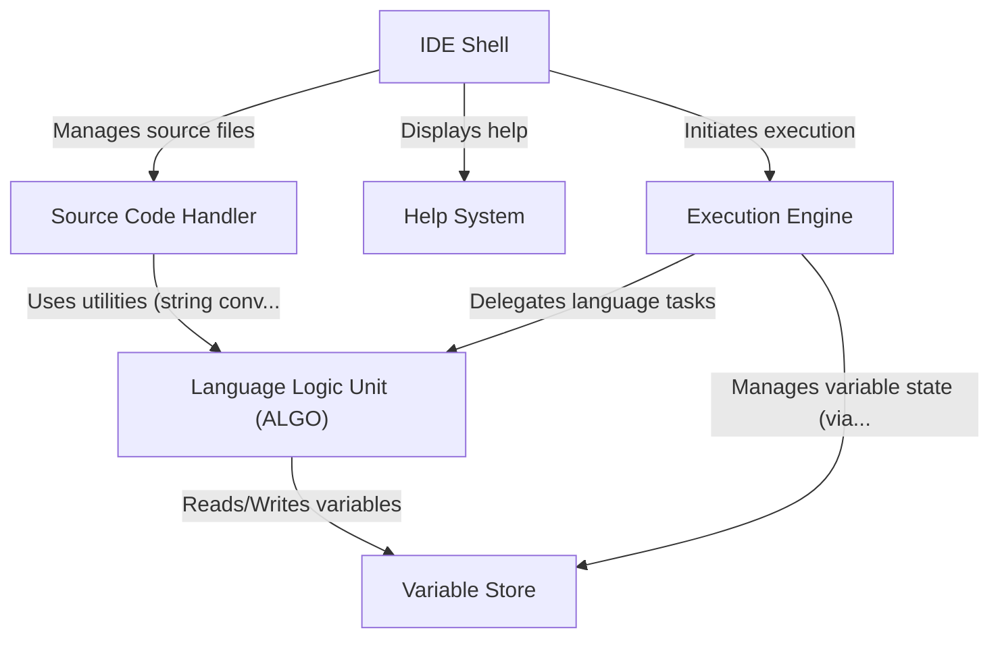

# Tutorial: hyperbole

Hyperbole is a **simple programming environment** designed for its *own custom language* (`.hyp` files).
It acts like a basic **IDE (Integrated Development Environment)**, allowing users to *open* and *view* source code files, get *help* on language keywords, and **execute** the code using an *interpreter*.
The system includes components to handle **source code** (*parsing*), manage **variables** (*memory*), perform language **logic** (*operations*), and provide **help**.

**Source Repository:** [https://github.com/namanvashistha/hyperbole](https://github.com/namanvashistha/hyperbole)

## Chapters

1. [IDE Shell](01_ide_shell.md)
2. [Source Code Handler](02_source_code_handler.md)
3. [Help System](03_help_system.md)
4. [Execution Engine](04_execution_engine.md)
5. [Language Logic Unit (ALGO)](05_language_logic_unit__algo_.md)
6. [Variable Store](06_variable_store.md)

---

